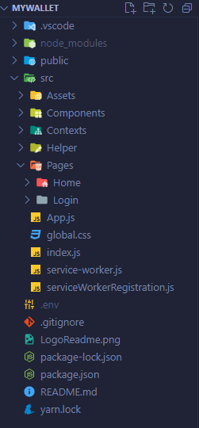

## 

### Go to site ➡️: [My Wallet](https://my-wallet-pink.vercel.app/login)

## Description 

The My Wallet application seeks to help those people who need to control their spending quickly and easily. In this first version of the app we have the basic features

## Features

- Work like PWA 
- Online Storage
- Login with Google
- Expense control

## Tech Stack

**Front:** React, Styled-Components, React-Router-Dom, Styled-Components-Icons.

**Proto:** Figma.

**Storage:** Firebase. 

## Structure Model
 

## Color Reference

| Color             | Hex                                                                |
| ----------------- | ------------------------------------------------------------------ |
| Primary Color |  #0066FF |
| Secondary Color |  #FDFDFD |
| Green Color |  #41CE69 |
| Red Color |  #FB4C4C |

